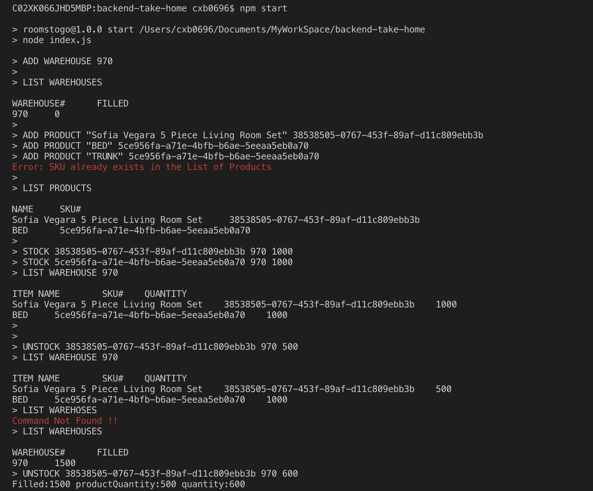
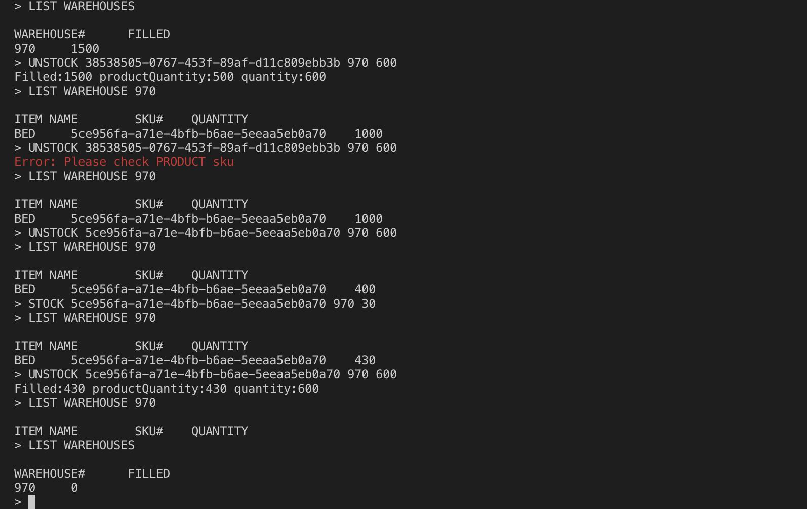

# Rooms To Go Engineering: Take Home Assignment

## Run this program
1. Clone this repository
2. npm install
3. npm start
4. [ctl + c] to quit the REPL

## Run Test cases
1. npm install -g jest
2. npm test

## Problem Statement
Create a command line REPL to manage product inventory.

Managing product inventory requires adding products to a product catalog and adding warehouses to store the products.

Supports 7 commands
## Details
- Our application will take in user input one line at a time.

Bold text denotes text that will be entered as-is, italics denote arguments that will be replaced by a value. Optional arguments are surrounded by square brackets ([]).

1. **ADD PRODUCT** *"PRODUCT NAME"* *SKU*

2. **ADD WAREHOUSE** *WAREHOUSE#*  *[STOCK_LIMIT]*

3. **STOCK** *SKU* *WAREHOUSE#* *QTY*

4. **UNSTOCK** *SKU* *WAREHOUSE#* *QTY*

5. **LIST PRODUCTS**

6. **LIST WAREHOUSES**

7. **LIST WAREHOUSE** *WAREHOUSE#**

## COMMAND HISTORY
Recorded in current working directory in ``./history.log``

## EXAMPLE SESSION
Here is an example session to show you what a run of your program should look like.
- Example Input is prepended with >
- Example output is not prepended with >.

